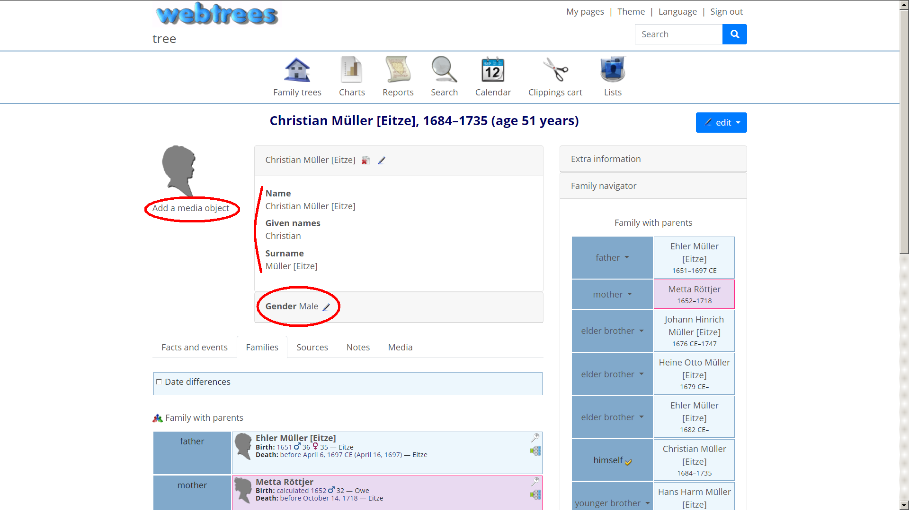
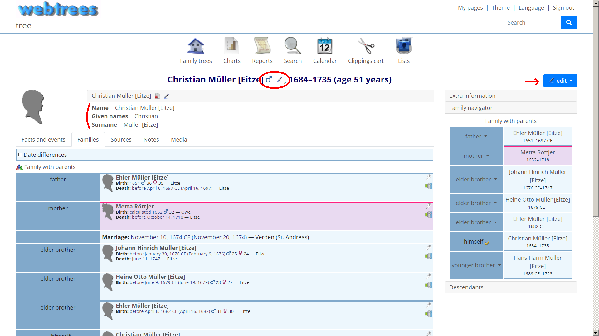

# Compact Themes Adjuster (Webtrees 2 Custom Module)

This [webtrees](https://www.webtrees.net/) custom module adjusts all themes, providing a more compact layout similar to the webtrees 1.x version. The project’s website is [cissee.de](https://cissee.de). 

This is a webtrees 2.x module - It cannot be used with webtrees 1.x.

## Contents

* [Features](#features)
* [Download](#download)
* [Installation](#installation)
* [License](#license)

### Features<a name="features"/>

* The overall width is adjusted for larger resolutions, as suggested [here](https://www.webtrees.net/index.php/en/forum/3-help-for-2-0-alpha/32882-solved-support-for-bigger-monitors#70135)
* Currently, mainly the individual page is adjusted further:
    * Smaller sidebar
    * Less padding between elements
    * The key-value pairs of the name parts are inline
    * Gender information is moved to the header (as an icon)
    * Media edit controls is moved to the edit menu (a better place for these edit controls may be the Media tab itself)
* The module now optionaly displays nicknames as in webtrees 1.x (before the surname). See [here](https://github.com/fisharebest/webtrees/issues/1401) for the related discussion.
* Note that this module itself is not a theme: The webtrees user will not be able to switch between the compact and the regular layout!

default 'webtrees' theme   |  adjusted 'webtrees' theme
:-------------------------:|:-------------------------:
 | 

* Further suggestions are very welcome!

### Download<a name="download"/>

* Current version: 2.0.1.2
* Based on and tested with webtrees 2.0.1. Cannot be used with webtrees 1.x. May not work with earlier 2.x versions!
* Download the zipped module [here](https://cissee.de/adjuster.latest.zip).
* Support, suggestions, feature requests: <ric@richard-cissee.de>
* Issues also via <https://github.com/ric2016/compact_themes_adjuster/issues>

### Installation

* Unzip the files and copy them to the modules_v4 folder of your webtrees installation.
* Enable the module via Control Panel -> All modules -> Compact Themes Adjuster.

### License<a name="license"/>

* **compact_themes_adjuster: a webtrees custom module**
* Copyright (C) 2019 - 2020 Richard Cissée

* Derived from **webtrees** - Copyright (C) 2010 to 2019 webtrees development team.

This program is free software: you can redistribute it and/or modify
it under the terms of the GNU General Public License as published by
the Free Software Foundation, either version 3 of the License, or
(at your option) any later version.

This program is distributed in the hope that it will be useful,
but WITHOUT ANY WARRANTY; without even the implied warranty of
MERCHANTABILITY or FITNESS FOR A PARTICULAR PURPOSE. See the
GNU General Public License for more details.

You should have received a copy of the GNU General Public License
along with this program. If not, see <http://www.gnu.org/licenses/>.
